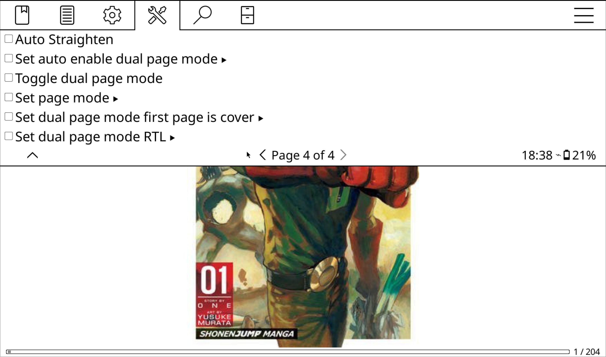

# Dispatcher

This plugin registers actions that can be executed via the **dispatcher**, also known as **Quick Menu** or **Profiles**.

[Learn more about Quick Menu & Profiles](https://koreader.rocks/user_guide/#L1-qmandprofiles)

## Actions

The following actions are available:

- Set Auto Enable Dual Page Mode
- Toggle Dual Page Mode
- Set Page Mode
- Set Dual Page Mode: First Page is Cover
- Set Dual Page Mode: RTL

These actions are registered under **Fixed Layout Documents**.

### Set Auto Enable Dual Page Mode

This action lets you turn the **automatic dual page mode** setting **on or off**.

### Toggle Dual Page Mode

This action allows you to **switch** between **dual** and **single page modes**.

### Set Page Mode

Use this action to **set** the document to **single** or **dual page mode**.

### Set Dual Page Mode: First Page is Cover

This action lets you **mark** whether the **first page is a cover** or not.

### Set Dual Page Mode: RTL

Use this to **enable or disable RTL** (Right-to-Left) reading in dual page mode.

## Usage Examples

Here are some ways these actions can enhance your reading experience.

### Folder With Comics

Suppose you have a folder full of comics. For all these comics, you want:

- RTL reading enabled
- The first page treated as a cover
- Dual Page Mode automatically activated in landscape

You can create a **profile** to do all of this using:  
`Auto-Execute → On Book Opening → If Book File Path Contains`
