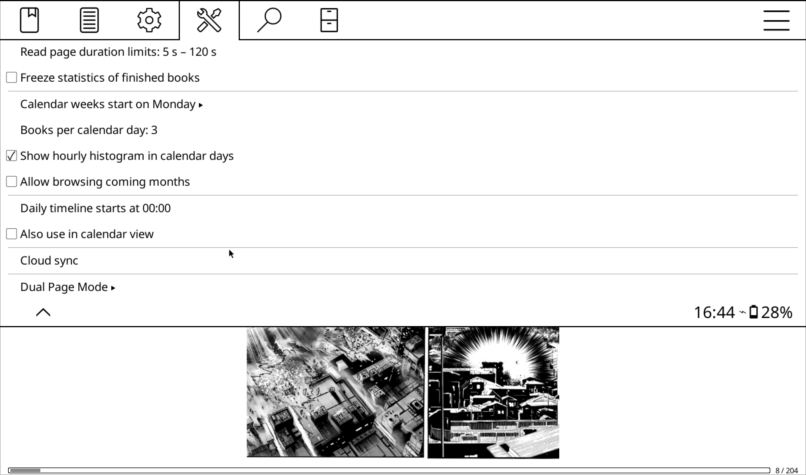
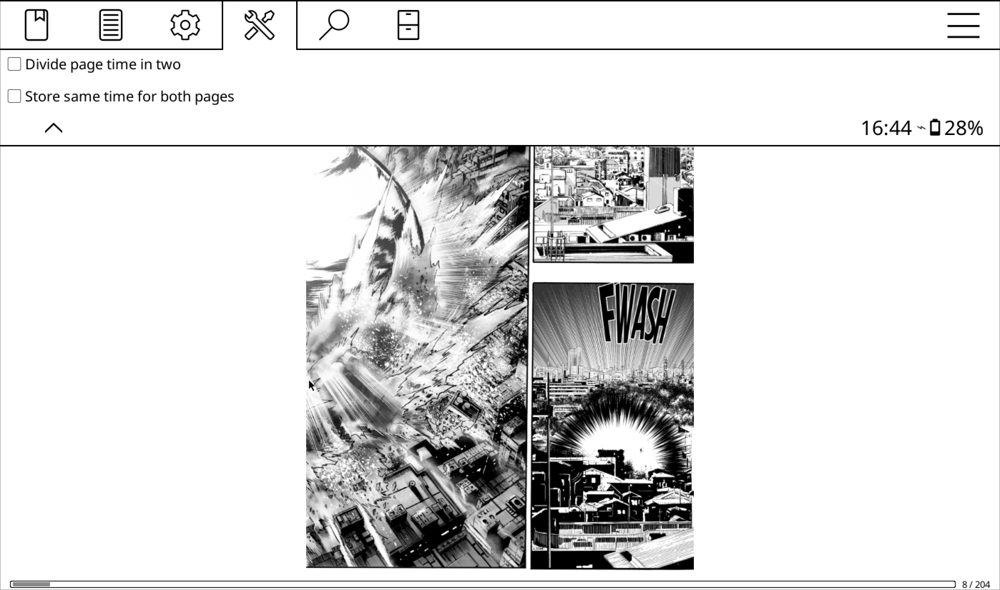

# Reading Statistics

This plugin comes with a patched version of the [ **Statistics** ](https://github.com/OGKevin/statistics.koplugin) plugin.  
This page explains the differences.

## Page Read Tracking

The default Statistics plugin can track how long you’ve spent on a single page.

However, since this plugin introduces the ability to view **two pages at once**,
the original plugin doesn’t handle this correctly.

That’s where the **patched version** comes in, it updates the tracking so it’s
aware when two pages are displayed side by side.

### Settings

You’ll find the relevant settings under:  
`Reading Statistics → Settings → Dual Page Mode`

  

#### Divide Page Time in Two

When enabled, the total time spent on `page1|page2` will be split evenly
between both pages.

For example: if you spend **10 minutes** reading two pages together, the plugin
will record **5 minutes** for page 1 and **5 minutes** for page 2.

#### Store Same Time for Both Pages

When enabled, the total time spent will be assigned in full to both pages.

For example: if you spend **10 minutes** reading two pages, the plugin will
record **10 minutes** for page 1 and **10 minutes** for page 2.
