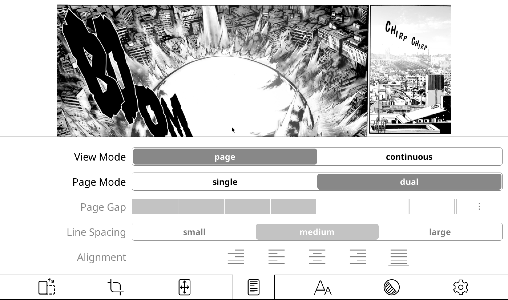

# Getting Started

This guide will help you go from:

  

to this:

## Installation

Follow these simple steps to get started:

1. Head over to the [releases page](https://github.com/OGKevin/comicreader.koplugin/releases/latest)  
   and grab the latest `.zip` file.
2. Unzip the contents into your **plugins** folder.
3. If you see a message about existing files in `statistics.koplugin`,  
   go ahead and let them be overwrittena, this keeps your reading statistics accurate.
4. Open any single-page document, and you’ll notice a new toggle option in the menu:

That’s it! You’re ready to start enjoying your comics with the new features.
